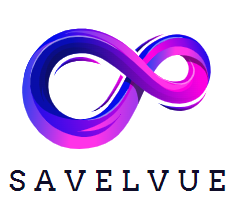

<p align="center">

</p>


<p align='center'>
   <a href="#apis">DOWNLOAD APs</a></br>
   <a>DOWNLOAD VueJS Scaffold</a>
</p>


# About Savelvue

Laravel is an authentication scaffold with expressive, elegant installation process. We believe development must be an enjoyable and creative experience to be truly fulfilling. Savelvue takes the pain out of development by providing an easy to install scaffold for authentication.

Advantages of Using Savelvue: 

- [Laravel Sanctum Default Installation](https://laravel.com/docs/9.x/sanctum#main-content).
- [Laravel Sentinel Package for Managing Role,Permission and OTP setup](https://cartalyst.com/manual/sentinel/6.x).
- Can be integrated with multiple frontend frameworks such as vue, react and flutter. By default we provide vue for frontend integration.

Savelvue is accessible, powerful, and provides tools required for large, robust applications.


# Savelvue Contributors

We would like to extend our thanks to the following sponsors for supporting Savelvue development. If you are interested in becoming a contributor, please email the [kevinamayi20@gmail.com](mailto:kevinamayi20@gmail.com).

- **Patrick Waweru**
- **Japheth Nyaranga**
- **Collins Rono**
- **Dennis Ngugi**


# Partners

- **[Techqast](https://techqast.co.ke/)**
- **Laravel Kenya**


<section id="apis"></section>


#  Vulnerabilities

If you discover a vulnerability within Savelvue, please send an e-mail to Kevin Amayi Amayi via [kevinamayi20@gmail.com](mailto:kevinamayi20@gmail.com). All vulnerabilities will be promptly addressed.


# Savelvue Setup

### To setup this project successfully, you need

- **[Composer For PHP Dependencies](https://getcomposer.org/)**
- **[PHP 8.0 Minimun requirement for Laravel 9](https://www.apachefriends.org/download.html)**
- **[MYSQL For Managing the database](https://www.apachefriends.org/download.html/)**
- **[If you wish to Install Frontend for Vue you need Node For installing Vue Dependencies ](https://nodejs.org/en/)**


## 1. Clone the Project Repository

- ### Clone the project Repository by Running this command in a folder you have created.
```
git clone https://github.com/KEVINAMAYI/savelvue.git 
```


.

## 2. Install Dependencies

- ### Once the project has been cloned, cd into the project and run.

```
composer install 
```

.


## 3. Add HasApiTokens to EloquentUser

- EloquentUser is the user being used by Sentinel, Add the Trait HasApiTokens so that Sentinel Users can be able to use Sanctum token as normal users.
- EloquentUser is located inside vendor\cartalyst\sentinel\src\Users\EloquentUsers.php

.


## 4. Configure Database and Run Migrations

- Rename .env-example to .env
- Add database details to the .env ( Make sure to create the dabase or you can create it during migration ).
- Add a FRONT_END_URL in the env, it will be used to receive the account activation and password reset code 
- Run migration to migrate the tables

.
.
.
.


## 5. Configure Mail for Sending Emails

- Configure Mail Data for Sending account activation code email and password reset code email. In my I am using smtp, host, port 465, and tls

.


## 6. Start Backend Server
- Start the serve by running the command below. Don't close the serve as this will be required to be used by the frontend server.

```
php artisan serve
```
.

# Savelvue Testing with POSTMAN

## 7. Importing JSON collection to POSTMAN for testing APIS

- Copy this JSON and save it in a file with a name eg. savelvue.postman_collection.json Import the JSON file to postman collection as shown.

```
{
	"info": {
		"_postman_id": "5e2c0ab2-ad02-4065-ace1-4e99c5c7075f",
		"name": "savelvue",
		"schema": "https://schema.getpostman.com/json/collection/v2.1.0/collection.json",
		"_exporter_id": "4350030"
	},
	"item": [
		{
			"name": "register",
			"request": {
				"method": "POST",
				"header": [
					{
						"key": "Accept",
						"value": "application/json",
						"type": "text"
					},
					{
						"key": "Authorization",
						"value": "Bearer 13|tMWJm7l5yWb1Dp1zS902XzlZW269wicNac1m00Kg",
						"type": "text"
					},
					{
						"warning": "This is a duplicate header and will be overridden by the Content-Type header generated by Postman.",
						"key": "Content-Type",
						"value": "application/json",
						"type": "text"
					}
				],
				"body": {
					"mode": "formdata",
					"formdata": [
						{
							"key": "first_name",
							"value": "Kevin",
							"type": "text"
						},
						{
							"key": "last_name",
							"value": "Amayi",
							"type": "text"
						},
						{
							"key": "email",
							"value": "kevinamayi20@gmail.com",
							"type": "text"
						},
						{
							"key": "password",
							"value": "Crazy534",
							"type": "text"
						},
						{
							"key": "password_confirmation",
							"value": "Crazy534",
							"type": "text"
						}
					]
				},
				"url": {
					"raw": "localhost:8000/api/register",
					"host": [
						"localhost"
					],
					"port": "8000",
					"path": [
						"api",
						"register"
					]
				}
			},
			"response": []
		},
		{
			"name": "activate-account",
			"request": {
				"method": "POST",
				"header": [],
				"body": {
					"mode": "formdata",
					"formdata": [
						{
							"key": "email",
							"value": "kevinamayi20@gmail.com",
							"type": "text"
						},
						{
							"key": "activation_code",
							"value": "T2R835mPkt5HYzx7RBmu3VFgRFYrXryA",
							"type": "text"
						}
					]
				},
				"url": {
					"raw": "localhost:8000/api/activate",
					"host": [
						"localhost"
					],
					"port": "8000",
					"path": [
						"api",
						"activate"
					]
				}
			},
			"response": []
		},
		{
			"name": "login",
			"request": {
				"method": "POST",
				"header": [],
				"body": {
					"mode": "formdata",
					"formdata": [
						{
							"key": "email",
							"value": "kevinamayi20@gmail.com",
							"type": "text"
						},
						{
							"key": "password",
							"value": "Crazy534",
							"type": "text"
						}
					]
				},
				"url": {
					"raw": "localhost:8000/api/login",
					"host": [
						"localhost"
					],
					"port": "8000",
					"path": [
						"api",
						"login"
					]
				}
			},
			"response": []
		},
		{
			"name": "set-password-reset-code",
			"request": {
				"method": "POST",
				"header": [],
				"body": {
					"mode": "formdata",
					"formdata": [
						{
							"key": "email",
							"value": "kevinamayi20@gmail.com",
							"type": "text"
						},
						{
							"key": "reset_password_code",
							"value": "",
							"type": "text",
							"disabled": true
						}
					]
				},
				"url": {
					"raw": "localhost:8000/api/send-password-reset-code",
					"host": [
						"localhost"
					],
					"port": "8000",
					"path": [
						"api",
						"send-password-reset-code"
					]
				}
			},
			"response": []
		},
		{
			"name": "reset-password",
			"request": {
				"method": "POST",
				"header": [],
				"body": {
					"mode": "formdata",
					"formdata": [
						{
							"key": "email",
							"value": "kevinamayi20@gmail.com",
							"type": "text"
						},
						{
							"key": "reset_password_code",
							"value": "tyFL46YlYI8no1GGAHMYGYHi2F9FzwRY",
							"type": "text"
						},
						{
							"key": "password",
							"value": "Crazy5346",
							"type": "text"
						},
						{
							"key": "password_confirmation",
							"value": "Crazy5346",
							"type": "text"
						}
					]
				},
				"url": {
					"raw": "localhost:8000/api/reset-password",
					"host": [
						"localhost"
					],
					"port": "8000",
					"path": [
						"api",
						"reset-password"
					]
				}
			},
			"response": []
		}
	]
}
```

.
.
.


## 8. Registering The User

- To register a user simply sent a POST request with first_name,last_name,email,password and password confirmation. This will register the user and sent an activation link to the user's email. Make sure that you have configured the email in the .env to send email.

.

- You will receive an email with a link to activate the account. 

.

- When the user clicks the link, the base url for the link should be you FRONT_END_URL that will receive the email and activation code passed through the url and send it back the activation code with the email to the /activate endpoint in the BACK_END for activating the account.

.

- In my case I will send the action code and email manually via the APIs to activate the user.

.

## 9. Login The User

- Once registered and activated, the user can login. The API will return the logged in user and an access token to be used on the FRONT_END to verify the logged in user.

.

.

## 10. Resetting Password

- To reset a password, the user needs to receive a password reset link with a password reset code that will be used to reset the password. As such we have to send a password reset code to the user using the send-password-code API.

.

- The user will receive an email with a link to reset the password. 

.

- When the user clicks the link, the base url for the link should be you FRONT_END_URL that will receive the email and password reset code passed through the url and send it back to the BACK_END for reseting the password.

.

- The FRONT_END should sent the password reset code along with other details to reset the password on the /reset-password endpoint. The  details required to reset password are the reset password code, password, password_confirmation and email.

- In my case I will send this data manually 

.


